<div align="center">

# xBDesk

**A Linux-desktop-style shell and UI kit for React web apps.**

Pages become windows, menu groups become folders, and your app gets a real desktop —
wallpaper, panel, clock, workspaces — plus the components to build the screens inside.

[](LICENSE)


[](https://xbfour.github.io/xBDesk/)

<sub>Pick a user on the sign-in screen — any password works (<code>hata</code> shows the error state).</sub>

**English** · [Türkçe](README.tr.md)

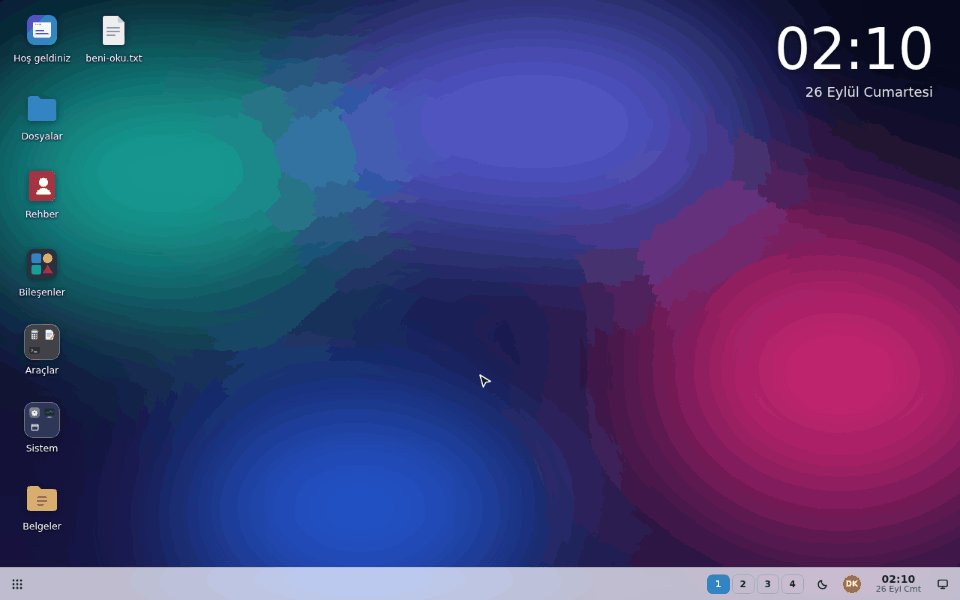

</div>

## Why

Admin panels, ERPs and internal tools tend to grow into dozens of pages behind one long sidebar,
and users can look at exactly one of them at a time. xBDesk turns those pages into **windows on a
desktop**: keep a report open while you enter an invoice, compare two customers side by side,
minimise what you are not using. Each window keeps its own route, scroll and form state, and the
open windows come back after a reload.

It is one component, `<Desktop>`, with no runtime dependencies. Everything inside a window is
your own React code — xBDesk ships a component library for it, but any UI kit (Tailwind,
shadcn/ui, MUI…) works just as well.

## Screenshots

<table>
  <tr>
    <td width="50%">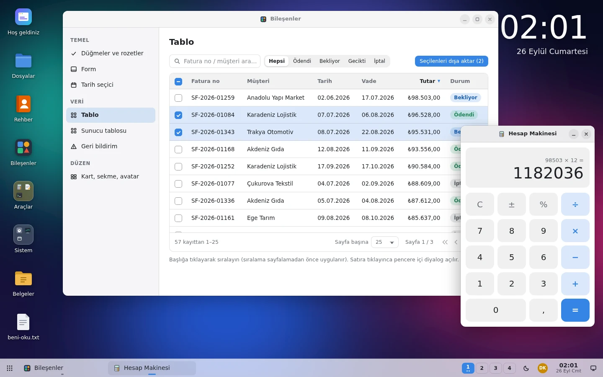<br><sub><b>Desktop</b> — windows, icons, folders, panel and clock</sub></td>
    <td width="50%">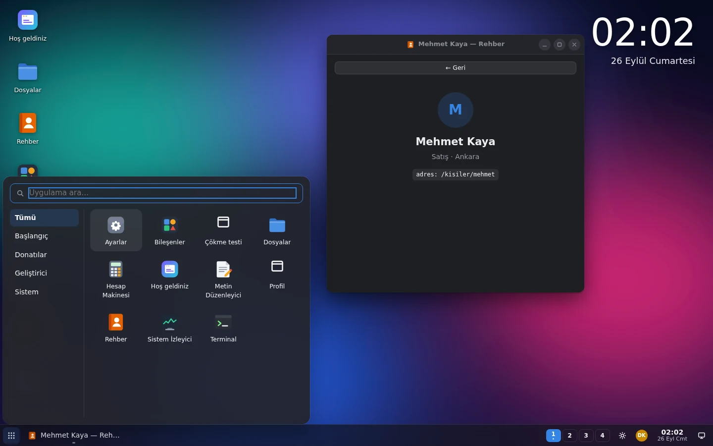<br><sub><b>Dark theme & app launcher</b> — search, categories, keyboard</sub></td>
  </tr>
  <tr>
    <td>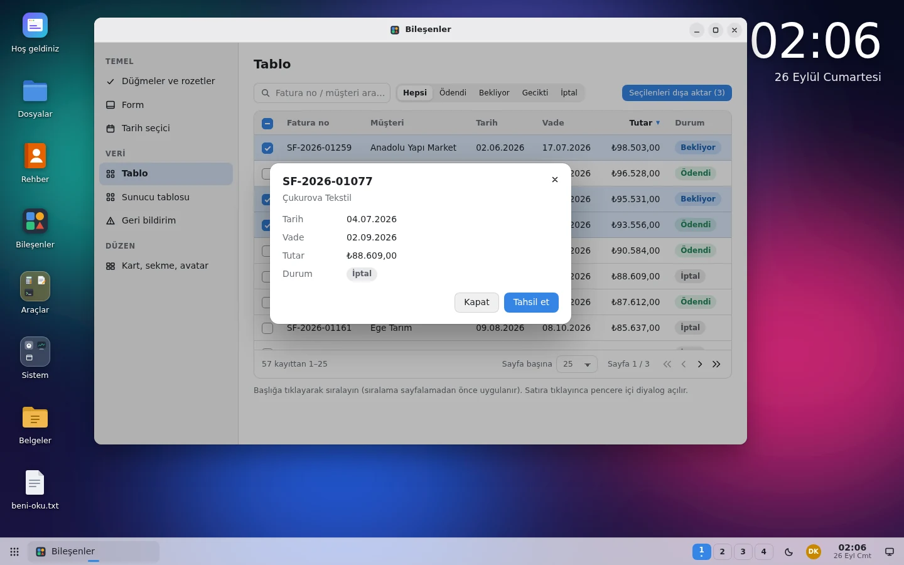<br><sub><b>Data table</b> — sorting, selection, paging; dialogs dim only their window</sub></td>
    <td>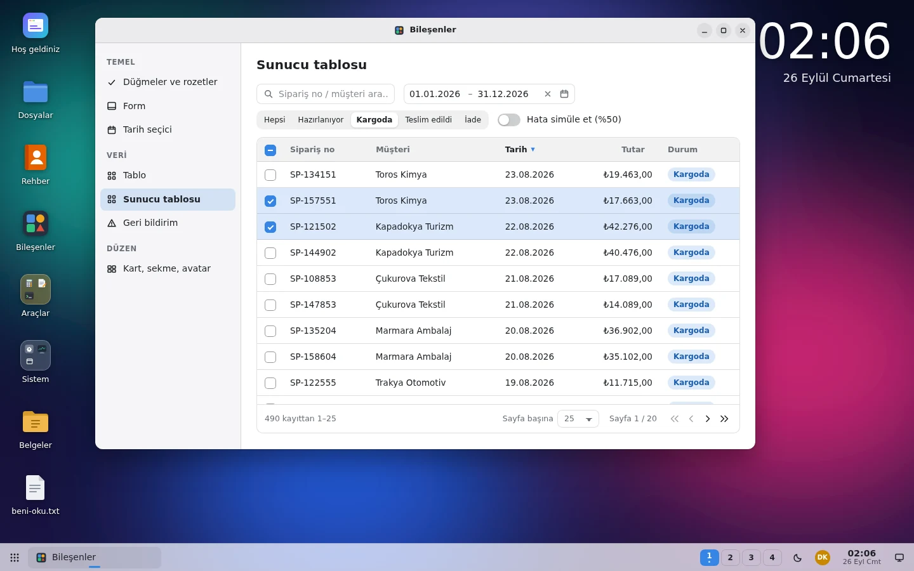<br><sub><b>Server-side table</b> — one request per page, stale requests cancelled</sub></td>
  </tr>
  <tr>
    <td>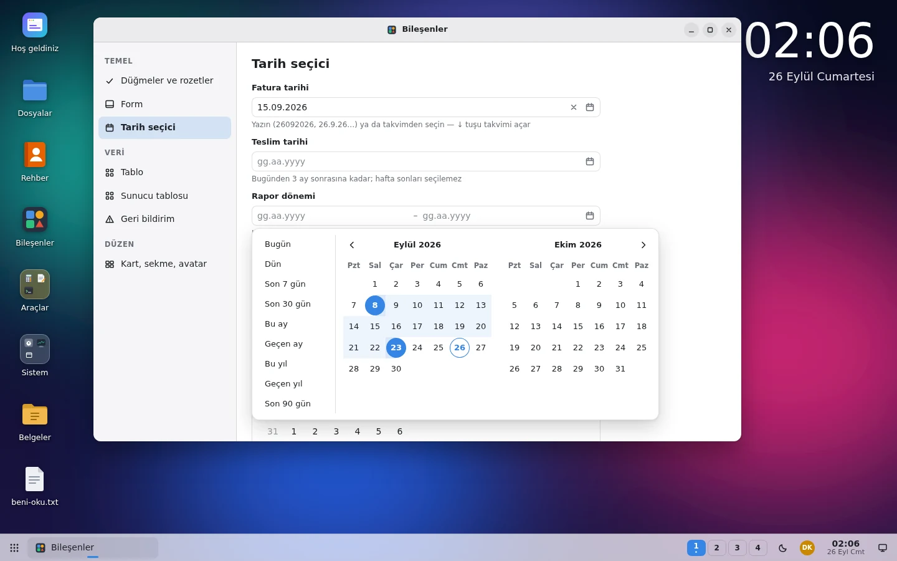<br><sub><b>Date range picker</b> — presets, two months, typed input</sub></td>
    <td>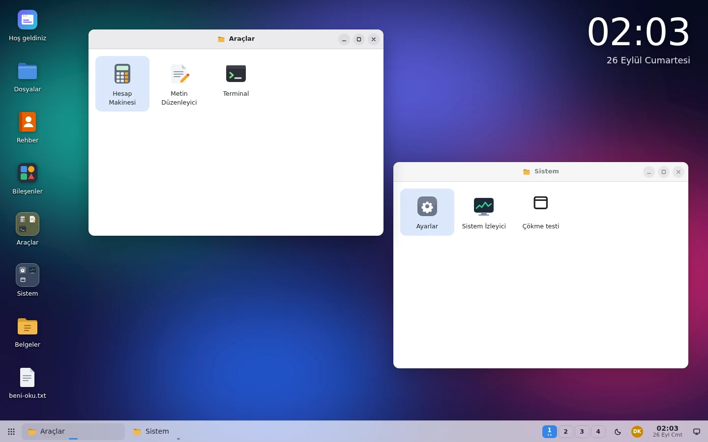<br><sub><b>Folders</b> — group pages like a menu, nest them freely</sub></td>
  </tr>
  <tr>
    <td>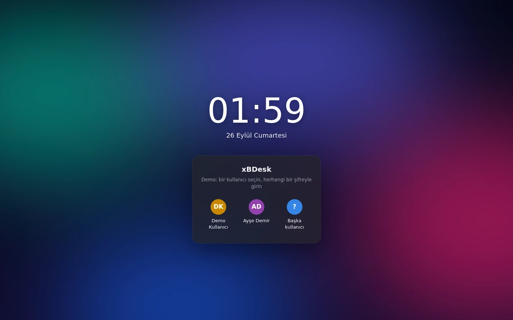<br><sub><b>Login & lock screen</b> — account tiles, errors, password reveal</sub></td>
    <td>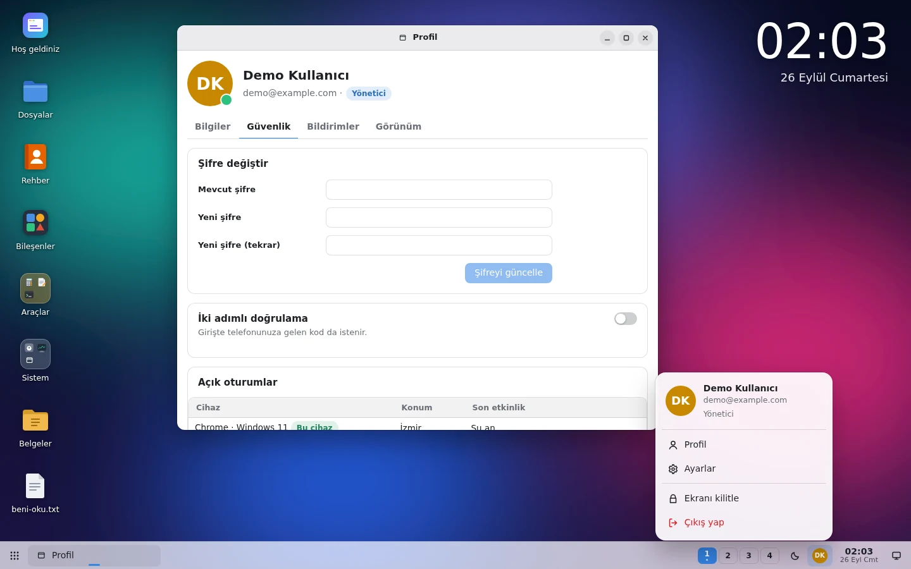<br><sub><b>User menu & profile</b> — built from the kit's own components</sub></td>
  </tr>
  <tr>
    <td>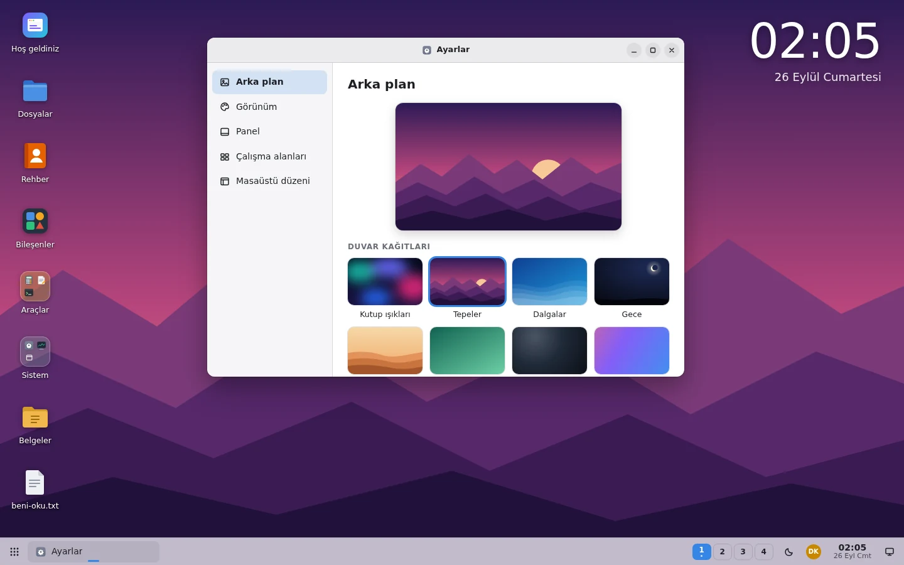<br><sub><b>Settings app</b> — wallpaper, theme, accent, panel, workspaces</sub></td>
    <td>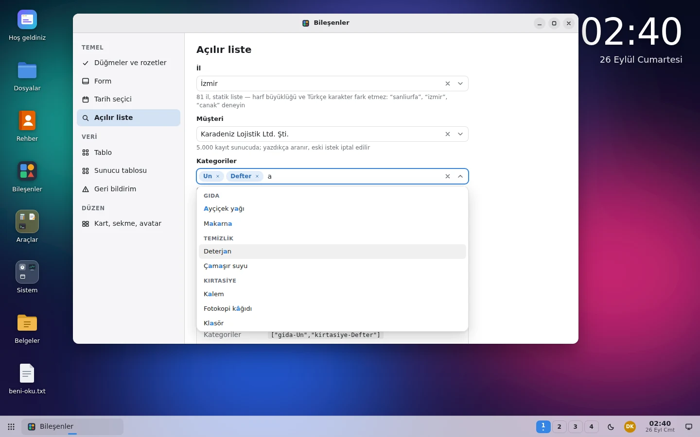<br><sub><b>Searchable dropdown</b> — server search, chips, groups, highlighted matches</sub></td>
  </tr>
</table>

## Features

**Desktop**

- **Window manager** — drag, resize, snap to screen halves, maximise, minimise, cascade; a crash in one window never takes down the others; `React.lazy` pages load when their window opens; close guards for unsaved changes.
- **Desktop icons & folders** — drag to arrange, rubber-band selection, keyboard navigation; folders (nested at any depth) open in their own window.
- **Panel** — app launcher with search and categories, task bar, workspaces, system tray, clock with calendar, notifications. Any screen edge, floating or docked — or compose your own from the parts.
- **Wallpapers & theming** — image, colour, gradient or any React node; light, dark or automatic; accent colour; every surface is a CSS custom property.
- **Per-window routing** — each window gets its own in-memory `react-router` (v6.4+ / v7): links and `useParams` work inside it, the browser URL never changes. Reuse your existing route tree as is.
- **Session restore** — preferences and open windows (with their route) survive reloads; bring your own storage for per-user persistence on a server.
- **Built-in settings app**, context menus, keyboard shortcuts (Ctrl+Alt+←/→ switches workspaces).

**Components**

| | |
|---|---|
| Basics | `Button` `IconButton` `Badge` `Card` `Avatar` `Alert` `Progress` `Spinner` `EmptyState` `Toolbar` |
| Forms | `Field` `Input` `Textarea` `Select` `Combobox` `Checkbox` `Switch` `RadioGroup` `SegmentedControl` — `Combobox` searches a static list or your server, single or multiple |
| Dates | `DatePicker` `DateRangePicker` `DateCalendar` — typed input, keyboard, min/max, disabled days, presets |
| Data | `DataTable` (client-side or server-side) + `useServerTable`, `Pagination`, `Tabs` |
| Overlays | `Dialog` (window-modal or desktop-wide), `useConfirm`, `Tooltip` |
| Layout | `SidebarLayout` |
| Account | `LoginScreen` (sign-in and lock screen), `UserMenu` |

- **i18n** — English, Turkish and German built in; every label can be overridden; month names, date formats and the first day of the week come from `Intl`.
- **Accessible by default** — real buttons and inputs, labelled fields, focus trapping in dialogs, roving focus in grids and menus.
- **Zero runtime dependencies** — peer dependencies are `react` and `react-dom` ≥ 18.2, plus `react-router-dom` ≥ 6.4 only if you use the router adapter.

## Install

xBDesk is not on npm yet. Install it straight from GitHub (the package builds itself on install):

```bash
npm install github:xBFour/xBDesk
```

or build a tarball and install that — handy for servers without GitHub access:

```bash
git clone https://github.com/xBFour/xBDesk && cd xBDesk
npm install && npm pack            # → xbdesk-0.1.0.tgz
cd ../your-app && npm install ../xBDesk/xbdesk-0.1.0.tgz
```

## Quick start

```tsx
import { lazy } from 'react';
import { Desktop, createSettingsApp, defineApp, type DesktopShortcut } from 'xbdesk';
import 'xbdesk/style.css';

const apps = [
  defineApp({
    id: 'customers',
    title: 'Customers',
    icon: '/icons/customers.svg', // image URL or any React node
    component: lazy(() => import('./CustomersPage')), // lazy pages load when their window opens
    window: { width: 960, height: 620 },
  }),
  defineApp({ id: 'invoices', title: 'Invoices', icon: <InvoiceIcon />, component: InvoicesPage }),
  createSettingsApp(), // wallpaper, theme, panel, workspaces
];

// Menu groups become folders on the desktop (strings are app ids).
const shortcuts: DesktopShortcut[] = [{ id: 'sales', title: 'Sales', color: '#e5a50a', items: ['customers', 'invoices'] }];

export default function App() {
  return <Desktop apps={apps} shortcuts={shortcuts} persistKey="my-app" />;
}
```

`<Desktop>` covers the viewport by default. Pass `fullscreen={false}` to fill a parent element
instead (the parent needs a height). An app placed in a folder does not get its own desktop icon —
set `showOnDesktop: true` if you want both.

## Recipes

<details>
<summary><b>Pages with routes</b> — one router per window</summary>

```tsx
import { Route, Routes } from 'react-router-dom';
import { createRouterApp } from 'xbdesk/react-router';

export const ordersApp = createRouterApp({
  id: 'orders',
  title: 'Orders',
  path: '/orders',
  element: (
    <Routes>
      <Route path="/orders" element={<OrderList />} />
      <Route path="/orders/:id" element={<OrderDetail />} />
    </Routes>
  ),
  windowTitle: (location) => (location.pathname.startsWith('/orders/') ? `Order ${location.pathname.split('/').pop()}` : null),
});
```

Open a specific page with `desktop.openApp('orders', { path: '/orders/1042' })`. Already have a
router-based app? Pass your whole route tree as `element` and every page works in a window,
guards and all.

</details>

<details>
<summary><b>Talking to the desktop from inside a window</b></summary>

```tsx
import { useState } from 'react';
import { Button, useCloseGuard, useConfirm, useDesktop, useWindow } from 'xbdesk';

export function InvoiceEditor() {
  const win = useWindow();
  const desktop = useDesktop();
  const { confirm, dialog } = useConfirm();
  const [dirty, setDirty] = useState(false);

  // Asked before the window closes (title-bar ×, task bar, desktop.requestClose…)
  useCloseGuard(() => !dirty || confirm({ title: 'Discard changes?', danger: true }));

  const save = () => {
    setDirty(false);
    win.setTitle('Invoice #1042');
    desktop.notify({ title: 'Saved', body: 'Invoice #1042' });
  };

  return (
    <>
      <Button onClick={() => setDirty(true)}>Edit</Button>
      <Button variant="primary" onClick={save}>Save</Button>
      <Button onClick={() => desktop.openApp('customers', { id: 42 })}>Open customer</Button>
      {dialog}
    </>
  );
}
```

`useDesktop()` returns the full controller — open, focus, tile or close windows, switch
workspaces, change preferences, show notifications. `<Desktop ref={…}>` gives you the same API
from outside.

</details>

<details>
<summary><b>Server-side table</b> — paging, sorting and filters on the server</summary>

```tsx
import { useState } from 'react';
import { DataTable, Input, useServerTable, type DataColumn } from 'xbdesk';

const columns: DataColumn<Order>[] = [
  { key: 'no', header: 'Order', nowrap: true },
  { key: 'customer', header: 'Customer' },
  { key: 'total', header: 'Total', align: 'right', cell: (r) => r.total.toLocaleString() },
];

export function Orders() {
  const [q, setQ] = useState('');
  const table = useServerTable<Order>({
    fetch: async ({ page, pageSize, sort, signal }) => {
      const params = new URLSearchParams({ page: String(page), pageSize: String(pageSize), q });
      if (sort) params.set('sort', `${sort.key}:${sort.dir}`);
      const res = await fetch(`/api/orders?${params}`, { signal });
      if (!res.ok) throw new Error(`Server error ${res.status}`);
      return res.json(); // { rows: Order[], total: number }
    },
    deps: [q], // back to page 1 when the search changes
    debounce: 300,
  });

  return (
    <>
      <Input placeholder="Search…" value={q} onChange={(e) => setQ(e.target.value)} />
      <DataTable {...table.tableProps} columns={columns} rowKey={(r) => r.id} selectable />
    </>
  );
}
```

Only the latest request may update the table — older ones are aborted through `signal`. Rows stay
on screen (dimmed) while the next page loads, and a failed request shows an error row with a
retry button. Without `total`, `DataTable` sorts and pages the rows you give it on the client.

</details>

<details>
<summary><b>Dates</b></summary>

```tsx
import { useState } from 'react';
import { DatePicker, DateRangePicker, Field, toISODate, type DateRange } from 'xbdesk';

export function ReportFilters() {
  const [due, setDue] = useState<Date | null>(null);
  const [period, setPeriod] = useState<DateRange>({ start: null, end: null });
  const isWeekend = (d: Date) => d.getDay() === 0 || d.getDay() === 6;

  return (
    <>
      <Field label="Due date" hint="Weekdays only">
        <DatePicker value={due} onChange={setDue} min={new Date()} isDateDisabled={isWeekend} />
      </Field>
      <Field label="Period">
        <DateRangePicker value={period} onChange={setPeriod} />
      </Field>
      <code>{period.start && toISODate(period.start)}</code>
    </>
  );
}
```

Values are local calendar days (`Date` at midnight); `toISODate` / `fromISODate` convert to and
from `YYYY-MM-DD` for APIs. Users can type dates in their locale's order (`26.09.2026`,
`09/26/2026`, `26092026`…), use the keyboard, or pick from the calendar.

</details>

<details>
<summary><b>Searchable dropdown</b> — static lists, server search, multiple values</summary>

```tsx
import { useState } from 'react';
import { Combobox, Field, type ComboboxOption } from 'xbdesk';

const cities: ComboboxOption<number>[] = [{ value: 34, label: 'İstanbul' }, { value: 35, label: 'İzmir' }, { value: 63, label: 'Şanlıurfa' }];
const tags: ComboboxOption[] = [{ value: 'food', label: 'Food', group: 'Retail' }, { value: 'freight', label: 'Freight', group: 'Services' }];

export function Pickers() {
  const [city, setCity] = useState<number | null>(null);
  const [customerId, setCustomerId] = useState<string | null>(null);
  const [selected, setSelected] = useState<string[]>([]);

  return (
    <>
      {/* Static list: filtered while typing, ignoring case and accents ("sanliurfa" finds "Şanlıurfa") */}
      <Field label="City">
        <Combobox options={cities} value={city} onChange={setCity} placeholder="Pick a city" />
      </Field>

      {/* Server search: stale requests are aborted, results shown as returned */}
      <Field label="Customer">
        <Combobox
          loadOptions={async (q, signal) => {
            const res = await fetch(`/api/customers?q=${encodeURIComponent(q)}`, { signal });
            const rows: Array<{ id: string; name: string; code: string }> = await res.json();
            return rows.map((c) => ({ value: c.id, label: c.name, description: c.code }));
          }}
          value={customerId}
          onChange={(id) => setCustomerId(id)}
        />
      </Field>

      {/* Several values as chips; options with a group get a heading */}
      <Field label="Tags">
        <Combobox multiple options={tags} value={selected} onChange={setSelected} />
      </Field>
    </>
  );
}
```

Options are `{ value, label, description?, icon?, group?, disabled? }`. With `loadOptions`, pass the
current selection in `initialOptions` so its label shows before the first search. Keyboard: ↑/↓,
PageUp/PageDown, Enter, Esc, and Backspace to remove the last chip.

</details>

<details>
<summary><b>Sign-in, lock screen and user menu</b></summary>

```tsx
import { useState } from 'react';
import { AppMenuButton, Clock, ColorSchemeToggle, Desktop, LoginScreen, Panel, SystemTray, UserMenu, WindowList, WorkspaceSwitcher } from 'xbdesk';

export function Shell() {
  const [user, setUser] = useState<User | null>(null);
  const [locked, setLocked] = useState(false);

  if (!user) {
    return (
      <LoginScreen
        title="Acme ERP"
        onLogin={async ({ username, password }) => {
          const signedIn = await api.login(username, password);
          if (!signedIn) return 'Wrong username or password'; // shown on the form
          setUser(signedIn);
        }}
      />
    );
  }

  return (
    <>
      <Desktop persistKey={`acme:${user.username}`}>
        <Panel>
          <AppMenuButton />
          <WindowList />
          <WorkspaceSwitcher />
          <SystemTray>
            <ColorSchemeToggle />
            <UserMenu name={user.name} email={user.email} onLock={() => setLocked(true)} onLogout={() => setUser(null)} />
          </SystemTray>
          <Clock showDate />
        </Panel>
      </Desktop>
      {locked && <LoginScreen mode="unlock" user={user} onLogin={async ({ password }) => (await api.verify(user.username, password)) ? setLocked(false) : false} />}
    </>
  );
}
```

`LoginScreen` only draws the form — authentication stays in your code. Return a string (or throw)
to show an error, `false` for the generic message.

</details>

<details>
<summary><b>Theming</b> — follow your app's theme and design tokens</summary>

```tsx
<Desktop
  colorScheme={theme} // follow your app's theme…
  onColorSchemeChange={(_scheme, resolved) => setTheme(resolved)} // …and report changes made on the desktop
  defaultPreferences={{ accentColor: '#16a34a', panelPosition: 'top' }}
  tokens={{ fontFamily: 'Inter, system-ui, sans-serif', radius: '6px', windowRadius: '10px' }}
  locale="en"
/>
```

Tokens map to CSS custom properties (`--xbd-window-bg`, `--xbd-accent`, …), so they can point at
your own variables — for example `windowBg: 'hsl(var(--background))'` with shadcn/ui. All class
names are prefixed `xbd-` and nothing is applied globally. Outside `<Desktop>` (a standalone
login page, say) wrap components in `<ThemeScope>`.

</details>

<details>
<summary><b>Persistence</b></summary>

`persistKey` stores preferences and open windows in `localStorage`. For per-user storage on your
server, pass `storage` instead — `load`/`save` for preferences and optional
`loadSession`/`saveSession` for windows; any of them may be async. While the list of apps is still
loading (e.g. permissions), set `appsReady={false}` so no window is dropped during restore.

</details>

## Browser support

Current Chrome, Edge, Firefox and Safari (the styles use `color-mix()`: Chrome 111+, Firefox 113+,
Safari 16.2+). Server-side rendering works; in the Next.js App Router, render `<Desktop>` from a
client component.

## Development

```bash
npm install
npm run dev          # playground with every component → http://localhost:5180
npm run typecheck
npm run build        # library → dist/
npm run build:demo   # the playground as a single self-contained HTML file → dist-demo/
```

The playground (`playground/`) doubles as the demo: a login screen, folders, the component gallery,
a server-side table backed by a fake API, and a profile page.

## License

[MIT](LICENSE) © 2026 Emrah Dedeoğlu
